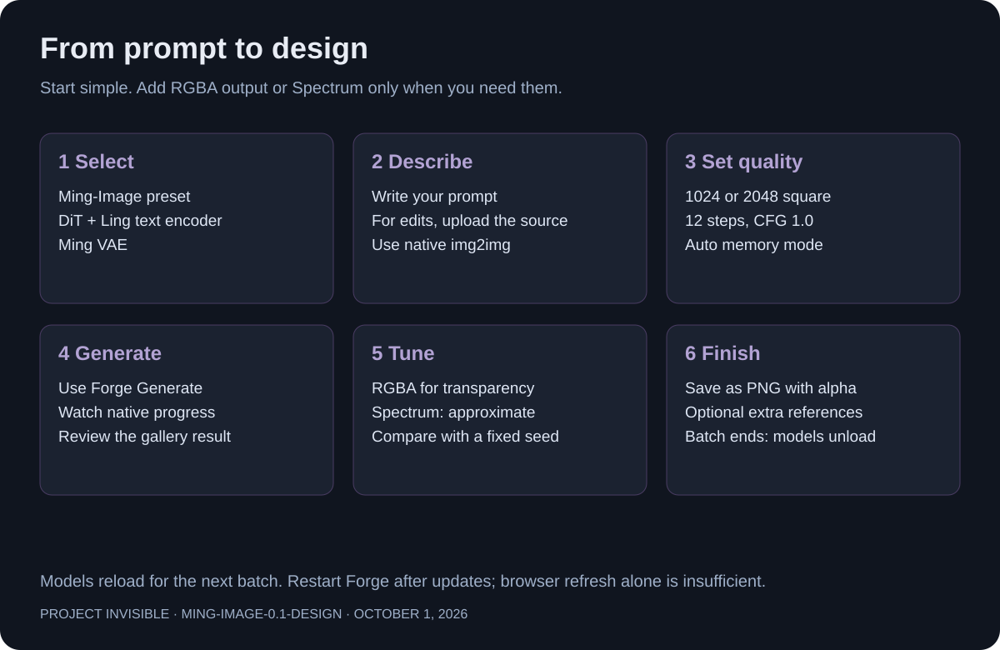
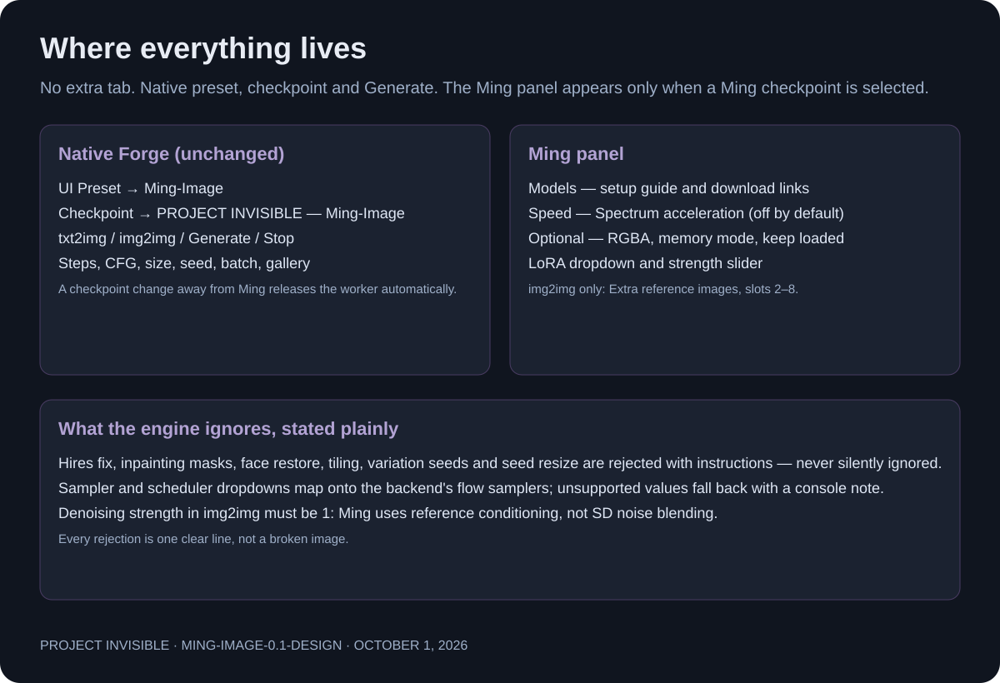
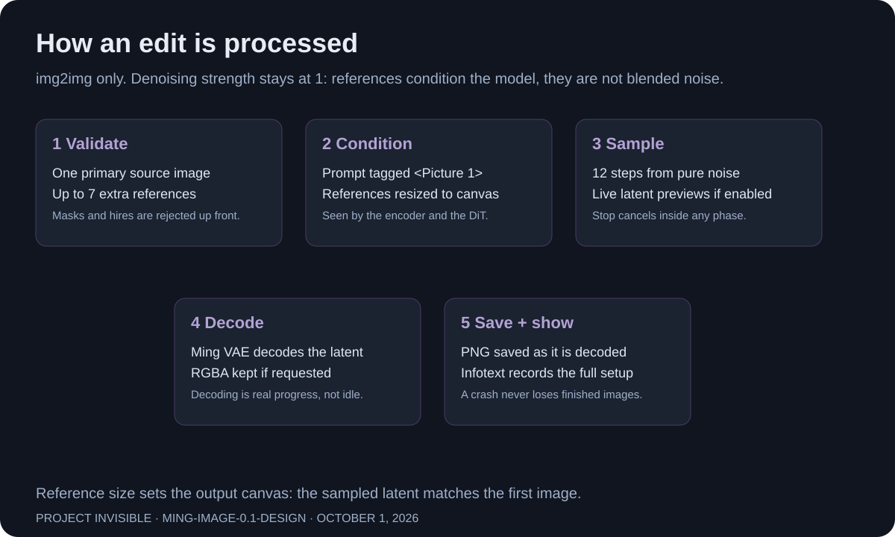

# Project Invisible — Ming-Image 0.1 Design

inclusionAI's **Ming-Image-0.1-Design** — a 6B model built for UI, infographics,
posters and other text-rich visual designs, with **RGBA transparent-background**
output — inside **Forge Neo**'s native txt2img/img2img workflow.

Unofficial Forge Neo extension that integrates Ming-Image-0.1-Design into the
normal preset, checkpoint and Generate workflow — **without a separate tab,
extra virtual environment, ComfyUI server or Forge core fork.**

Select **Ming-Image** under **UI Preset**, then use the normal **Generate** button.



> [!IMPORTANT]
> Independent community extension. Not an official Ming or inclusionAI product.
> Model weights are **not** included; downloads require your approval and a
> button click. **Generate never downloads weights or tokenizers.**

---

## Project overview

Project Invisible is an independent family of Forge Neo extensions (H3,
Qwen-Image-2.1, Boogu-Image, SenseNova, Ideogram 4, Ming-Image) that share one
philosophy:

- Your **normal checkpoint dropdown** lists the model; the **stock Generate**
  button runs the official pipeline.
- The actual backend runs in a **dedicated process** using Forge's own Python
  against a pinned vendored ComfyUI checkout (the real Ming-Image
  implementation, ComfyUI PR #16482 — not an SD/Flux pipeline). Closing that
  process releases its RAM and VRAM.
- **Deleting the extension folder leaves Forge 100% stock.** Every hook keeps
  the original and delegates; nothing under `modules/`, `backend/` or
  `extensions-builtin/` is modified.
- **Other extensions are never affected.** Non-Ming checkpoints take their
  ordinary paths; wrappers are recorded and restored exactly on unload.

## Installation

1. Finish your current generation and close Forge.
2. Install through **Extensions → Install from URL**, or extract this ZIP into
   Forge's `extensions` folder. Use one method, not both.

   ```text
   https://github.com/mishrasiddharth08/Project-Invisible-Ming-Image.git
   ```

3. Start Forge, then refresh the browser.
4. Select **Ming-Image** under **UI Preset**. The checkpoint selector shows
   **PROJECT INVISIBLE — Ming-Image 0.1 Design**.
5. Open **Ming → Models** for download links and folder instructions.

After updates: restart Forge **and** refresh the browser — a browser refresh
alone does not reload Python code.

## Models — reuse your downloads

Manual downloading is recommended. Obtain files from
[Comfy-Org/Ming-Image](https://huggingface.co/Comfy-Org/Ming-Image/tree/main)
(community packaging of [inclusionAI/Ming-Image-0.1-Design](https://huggingface.co/inclusionAI/Ming-Image-0.1-Design)).
Read the model's license before downloading or using it.

| Required component | Recommended example |
| --- | --- |
| DiT | `ming_image_0.1_design_int8_convrot.safetensors` or `_bf16` |
| Design-Layer variant (optional) | `ming_image_0.1_design_layer_*` |
| Text encoder | `ming_image_0.1_ling_mini_2.0_int8_convrot.safetensors` (or `w4a8`, `bf16`) |
| VAE | `ming_image_vae_bf16.safetensors` |

Existing folders are scanned recursively: `models/Ming-Image/` (recommended for
a new installation), `models/diffusion_models/`, `models/text_encoders/`,
`models/VAE/`, `models/Lora/`. For other locations, add absolute directories to
`model_roots` in `config.json` and click **Refresh local files**.

Tensor headers and the real loader check component compatibility; the filename
alone is not proof.

## Make an image

1. Enter a prompt and press **Generate**.
2. Recommended settings: **1024 × 1024** (or **2048 × 2048**), **12 steps**,
   **CFG 1.0**.
3. Width and height must be multiples of **16**, from 256 through 4096.
4. Native seed, steps, dimensions, CFG, batch size and batch count are honored.
   Batch images run sequentially to reduce peak memory.
5. **RGBA:** tick *RGBA (transparent background)* and phrase the prompt with the
   model's recommended transparent-background phrasing; the PNG is saved with
   alpha. The checkerboard in previews is display only.

## Panel guide



## Edit an image



1. Open the existing **img2img** tab and add your photo.
2. Set **Denoising strength to 1** — this is Ming reference conditioning, not
   SD noise blending.
3. Optional additional images are under **Extra reference images** (Reference
   2–8). Use consecutive slots so numbering stays clear.
4. Masks, inpainting, Hires fix, tiling and face restoration are rejected with
   instructions instead of being silently ignored.

## LoRAs

Choose a Ming-Image LoRA in the panel or insert `<lora:filename:strength>`
prompt tags. Only adapter keys matching the Ming model are accepted; adapters
are applied as a removable runtime patch (never merged into quantized weights)
and unpatched after each image. Non-Ming adapters are rejected.

## Speed — Spectrum

Optional approximate CFG acceleration in **Ming → Speed**, ported from the
Project-Invisible Qwen-Image-2.1 implementation:

- Separate cond/uncond prediction histories, warmup and final steps reserved
  for real work, stride 3, and a magnitude guard that falls back to real
  computation whenever a forecast is untrustworthy.
- **At CFG 1 it does nothing by design** (there is no uncond pass to skip).
- Off by default — the safe setting, not the fastest. PNG metadata records
  real and forecast pass counts.

## Hardware and quantization

- **NVIDIA CUDA** is the tested path on **6, 8, 12, 16, 20, 24 and 32 GB**
  cards. Memory mode **auto** reads your actual card and stages offload
  accordingly; Forge's own models are unloaded before each request.
- **AMD ROCm** works with BF16 weights; packed int8_convrot / w4a8 kernels are
  not verified there and are never chosen automatically. DirectML is not supported.
- Format selection is per-tier; your explicit dropdown choice always wins.
  See [QUANTIZATION.md](QUANTIZATION.md) for the full matrix.

## Progress and memory

- Exactly two bars: **current image** plus Forge's **overall batch** bar.
- Enable Forge's **Live previews** for approximate latent previews.
- By default the worker releases memory after each request; **Keep model in
  memory** permits reuse between runs. Selecting another preset always stops
  this extension's active job and releases its worker.
- **Stop** cancels the dedicated worker, including while encoding or decoding.
  It never kills Forge or another extension's process.

## Testing status — read before relying on this release

**This release has not yet been validated on live hardware.** Due to time
unavailability, no generation run against real Forge Neo, real GPU hardware or
the real Ming-Image weights has been performed at the time of publishing.

What **has** been verified, from a clean checkout:

- All Python modules compile; the CPU test suite passes
  (`tests/test_contracts.py`: UI arity contract, config-key passthrough,
  Spectrum branch separation and off-path behavior).
- Model catalog hashes match the published `Comfy-Org/Ming-Image` files.
- The vendored backend pin resolves to the actual ComfyUI PR #16482 merge commit.

What remains **unverified** and expected-but-not-proven:

- A full txt2img and img2img generation against live Forge Neo on CUDA.
- Spectrum's hook path against the real vendored `final_layer` module layout.
- ROCm behavior, every quantization format, and every VRAM tier in practice.

If you test it, please report your Forge version, GPU, precision, steps, CFG,
enabled options and the complete terminal error with any issue. Results from
real runs will be recorded in `VALIDATION.md` as they arrive. Until then,
treat this release as a tested-in-principle build, not a field-proven one.

## Compatibility and honest limits

- NVIDIA CUDA is the tested path. AMD ROCm and CPU depend on backend/kernel
  support; packed quantization in particular is hardware dependent.
- No claim is made that every GPU, every VRAM size or every future Forge
  update will work. A changed host hook fails with an error rather than
  patching Forge.
- Spectrum trades exactness for speed at CFG above 1: the same seed no longer
  guarantees the identical image.
- Everything above that is *expected to work* rather than *verified* is
  labelled as such in [QUANTIZATION.md](QUANTIZATION.md).

To uninstall: close Forge and remove this extension's folder. Your downloaded
models and generated images are separate and remain available.

## Troubleshooting

| Symptom | Fix |
| --- | --- |
| No Ming preset | Restart Forge fully; check the terminal for `[PI-Ming]` errors. |
| Missing model | Open Ming → Models, verify all three paths, then Refresh local files. |
| Wrong component | Use the Ming Ling-mini text encoder and the Ming VAE — headers reject mismatches with one clear line. |
| Out of memory | Reduce dimensions, use **lowvram**, prefer `int8_convrot` / `w4a8` files, close other GPU jobs. |
| Stale browser controls | Refresh the browser after restarting Forge. |
| Need help | Include the complete terminal error, model filenames and settings. |

**For any complaints or concerns, please raise them on GitHub:**
[open an issue](https://github.com/mishrasiddharth08/Project-Invisible-Ming-Image/issues) —
include your Forge version, GPU, precision, steps, CFG, enabled options and the
complete terminal error so the problem can be reproduced. Community discussion
and testing reports are equally welcome.

## Credits and licenses

Thanks to inclusionAI, Kijai and Comfy-Org (Ming-Image support, ComfyUI PR
#16482), the ComfyUI contributors, Haoming02 / Forge Neo, and the Project
Invisible extensions used as integration references.

See [NOTICE](NOTICE), [LICENSE](LICENSE) and `vendor/ComfyUI/LICENSE`.
Model licenses remain separate.

## Special thanks

- [r/sdforall](https://www.reddit.com/r/sdforall/) — community discussion and testing
- [r/SECourses](https://www.reddit.com/r/SECourses/) — community discussion and testing
- [**Haoming02 / sd-webui-forge-classic (neo branch)**](https://github.com/Haoming02/sd-webui-forge-classic/tree/neo) — the Forge Neo tree this extension targets
- [**inclusionAI**](https://huggingface.co/inclusionAI/Ming-Image-0.1-Design) — Ming-Image-0.1-Design
- [**Kijai / Comfy-Org**](https://github.com/Comfy-Org/ComfyUI/pull/16482) — the Ming-Image ComfyUI implementation this extension vendors
- [**ComfyUI**](https://github.com/comfyanonymous/ComfyUI) — backend and upstream sampler/scheduler coverage
- The Forge / AUTOMATIC1111 community — for the extension ecosystem this plugs into
- Project Invisible extensions — memory policy, GPU compatibility and extension philosophy

Thank you to the wider Forge, Diffusers, Ling and open-source communities.